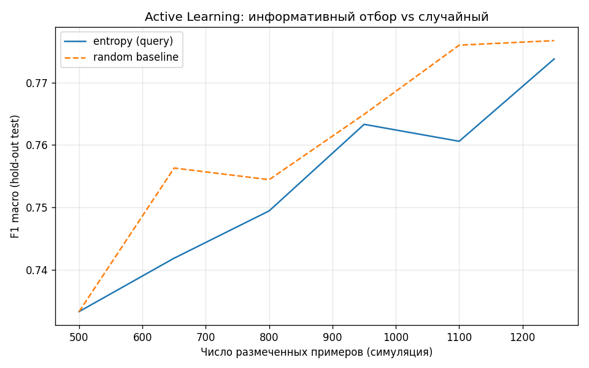

# Active Learning (этап 4)

- **Стратегия:** entropy vs random (см. `al_config.yaml`).
- **Последняя F1 macro (entropy):** 0.7737977404589951
- **Последняя F1 macro (random):** 0.7767308774409164
- **Размеченных (финал):** 1250

Симуляция: метки из пула взяты из `label_segment_ref` (oracle).
На коротких циклах и одном hold-out случайный отбор иногда не хуже entropy — смотрите кривую и повторите с другим `random_state` при необходимости.

